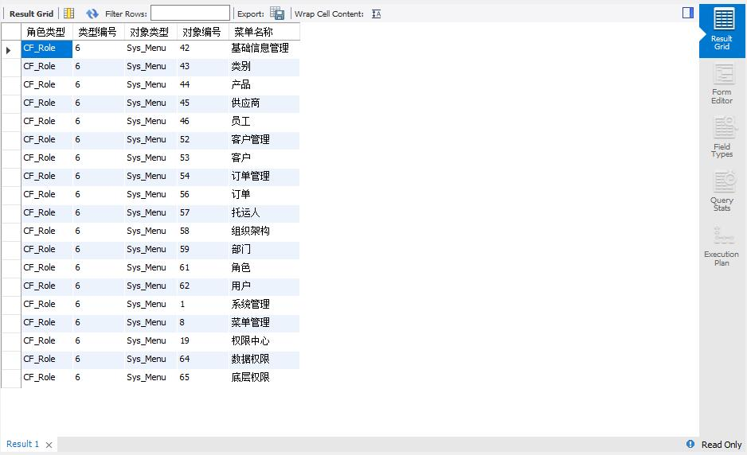
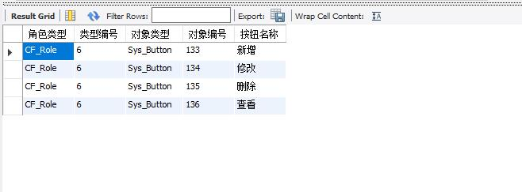

## 查询用户test1可以查看的用户（Sys_menu）
### 代码如下：
      select cp.PrivilegeMaster as '角色类型',
		            cp.PrivilegeMasterKey as '类型编号',
                 cp.PrivilegeAccess as '对象类型',
                 cp.PrivilegeAccessKey as '对象编号',
                  sm.MenuName as '菜单名称'
        from cf_privilege as cp
	              left join sys_menu as sm on cp.PrivilegeAccessKey=sm.MenuID and cp.PrivilegeAccess='sys_menu'
        where ((cp.PrivilegeMaster='CF_Role'
		            and cp.PrivilegeMasterKey
                in(select RoleID from cf_userrole as cur
			          left join cf_user as cu on cur.UserID=cu.UserID where cu.LoginName='test1'))
	    	or
                 (cp.PrivilegeMaster='CF_User'
                  and cp.PrivilegeMasterKey=(select UserID from cf_user where LoginName='test1')))
        and 
		              cp.PrivilegeOperation='Permit' and cp.PrivilegeAccess='Sys_Menu';
### 查询结果：

###  伪代码：
    a.由名称查找人员编号UserID
    b.由人员编号UserID查找改人员所对应的角色集合RoleIDs
    c.权限表 LEFT JOIN 页面表并查找
      角色类型为CF_Role   AND   角色编号在角色集合RoleIDs中
    OR
      角色类型为CF_User   AND   人员编号为UserID
     AND 权限属性为Permit   AND   权限为Sys_Menu的数据
  
## 查询对订单(order)页面中的操作权限(sys_button)
### 代码如下：
    select cp.PrivilegeMaster as '角色类型',
		  cp.PrivilegeMasterKey as '类型编号',
          cp.PrivilegeAccess as '对象类型',
         cp.PrivilegeAccessKey as '对象编号',
          sb.BtnName as '按钮名称'
    from cf_privilege as cp
	         left join sys_button as sb on cp.PrivilegeAccessKey=sb.BtnID and cp.PrivilegeAccess='sys_button'
           left join sys_menu AS sm ON sb.MenuNo = sm.MenuNo
    WHERE ((cp.PrivilegeMaster = 'CF_Role'
		    and cp.PrivilegeMasterKey
             IN (SELECT RoleID FROM cf_userrole AS cur
			       LEFT JOIN cf_user AS cu ON cur.UserID = cu.UserID WHERE cu.LoginName='test1' ))
	  	or
			      (cp.PrivilegeMaster = 'CF_User'
			      and cp.PrivilegeMasterKey = (select UserID from cf_user where LoginName = 'test1')))
       and
			        cp.PrivilegeOperation = 'Permit' and cp.PrivilegeAccess = 'Sys_Button' and sm.MenuName = '订单';
### 查询结果：

### 伪代码：
    a.由名称查找人员编号UserID
    b.由人员编号UserID查找改人员所对应的角色集合RoleIDs
    c.权限表 LEFT JOIN 按钮表 LEFT JOIN 页面表并查找
        角色类型为CF_Role   AND   角色编号在角色集合RoleIDs中
      OR
        角色类型为CF_User   AND   人员编号为UserID
        AND 权限属性为Permit   AND   权限为Sys_Button AND 菜单名字为订单的数据
